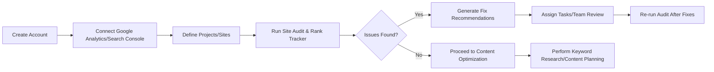
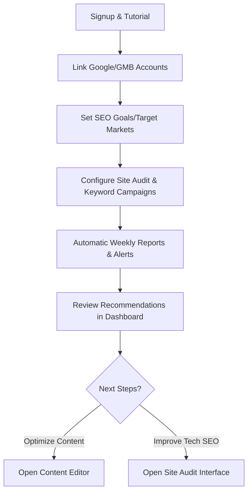
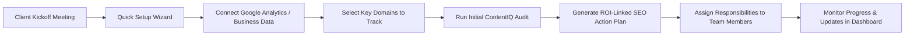

# SEO/AEO Platforms Gap Analysis & Improvement Report

## Executive Summary

Across all platforms, **high cost/complexity** is a recurring barrier. Most leading tools are enterprise-grade and expensive, often requiring significant setup time and developer resources【111†L121-L129】【111†L141-L146】. User reviews repeatedly cite steep learning curves and overwhelming interfaces (Semrush, Conductor, Botify, Surfer, DeepCrawl)【113†L167-L174】【117†L42-L51】. Another persistent issue is **limited AEO (Answer Engine Optimization) support**: virtually none of the incumbent tools track AI/answer-engine citations or optimize specifically for AI answer visibility【111†L194-L202】【126†L270-L279】. Common strengths include **comprehensive SEO data and analytics** (rich keyword/backlink databases, deep audits) and **extensive feature sets**, often bolstered by growing AI capabilities【101†L149-L158】【113†L175-L181】. However, they often lack robust collaboration/multi-user features and transparent pricing. To address these gaps, a new competitor should prioritize ease-of-use (guided onboarding, intuitive UI), flexible team collaboration, clear usage-based pricing, and built-in AEO metrics. Suggested KPIs to track include user adoption/retention (churn, active users), feature usage, and organic traffic/ROI lift for clients. 

---

## Ahrefs

**Gap Analysis:** Ahrefs excels in backlinks and keyword research but has limitations. Users note it is **expensive** and less accessible for SMBs【101†L164-L172】. It lacks local SEO tools (e.g. listing management) and richer competitor benchmarking beyond basic domain compare【101†L170-L177】. Its AI features (e.g. Content Assistant) are criticized for accuracy【101†L170-L177】. Team collaboration is minimal (1–2 users included; additional seats cost extra) and there’s no in-app content publishing or task assignment. The *Site Audit* is solid but can miss some page-level UX issues (no dedicated Core Web Vitals module) and has manual review steps. Integrations cover GA/GSC but are limited compared to others (no native Slack or CMS plugins). The pricing/credit logic (rows of data, crawl credits) is confusing for some users【17†L678-L687】, with no free trial beyond limited tools.

| **Gap**                        | **Recommendation**                                    | **Impact** | **Effort** |
|--------------------------------|-------------------------------------------------------|------------|------------|
| High price for small users【101†L164-L172】            | Introduce a lower-cost entry tier or credits, and optional pay-as-you-go data packages. | High       | Medium     |
| No local SEO module【101†L173-L177】                   | Add local tools (Google Business integration, review management) and local rank tracking. | High       | Medium     |
| Limited collaboration (single-user focus)             | Build multi-user projects/workspaces with roles/permissions. Provide team dashboards. | High       | High       |
| No content publishing/automation                  | Integrate with WordPress/HubSpot for one-click publishing of optimized content. Add CMS connectors. | Medium     | High       |
| Complex pricing/credit system                        | Simplify pricing: quota-based plans with rollover credits, transparent usage metrics. | High       | Medium     |
| AI feature accuracy concerns【101†L170-L177】          | Improve AI models or add human validation workflows. Provide confidence scores for AI suggestions. | Medium     | High       |

**Implementation Considerations:** New data feeds and ML training needed for AI improvements; additional infrastructure for real-time local data. Partnerships with local listing providers (e.g. Yext) or agencies. Data storage for multi-user projects, and possible legal consent for added analytics APIs. 

**Onboarding & Audit Workflow Improvement:** Current onboarding is largely self-serve. We propose a guided “Quick Setup Wizard” that leads users through connecting Google accounts, setting up projects, and launching an initial audit. The audit workflow would automatically highlight top issues and suggest prioritized fixes. 



---

## SEMrush

**Gap Analysis:** Semrush is feature-rich but can overwhelm new users. Reviews note its **complex interface** and steep learning curve【103†L994-L1000】. It lacks easy multi-competitor benchmarking in one view (users desire side-by-side analytics)【103†L888-L897】. Its AI tools (Content Assistant, etc.) sometimes lack domain-specific filtering (“off-brand” keywords)【103†L897-L905】. The cost is high for small teams, and some needed features (Historical Data, additional users) require pricier plans. Local SEO is strong, but collaboration features are basic (shared templates exist but no advanced workflow). Onboarding is mostly DIY, with limited hand-holding. Some users report data accuracy issues (keyword volumes, outdated links). SEMrush also lacks tracking of AI answer citations (common shortcoming)【111†L194-L202】.

| **Gap**                                        | **Recommendation**                                       | **Impact** | **Effort** |
|------------------------------------------------|----------------------------------------------------------|------------|------------|
| Overwhelming UI/new user onboarding【103†L994-L1000】       | Simplify dashboards for beginners; offer guided tours and context-sensitive help.  | High       | Medium     |
| No side-by-side competitor comparison【103†L888-L897】        | Add a “Competitive Dashboard” to compare multiple domains/metrics in one view. | Medium     | Medium     |
| Irrelevant keywords due to generic filters【103†L897-L905】  | Incorporate ML-based brand filters to auto-eliminate irrelevant terms. | Medium     | High       |
| High cost/complex plan limits                    | Introduce more granular or additive plans (e.g. pay-per-feature or user seats). | High       | Medium     |
| Missing AEO metrics (no answer engine tracking)【111†L194-L202】 | Develop AEO module to track mentions in ChatGPT, Google AI (similar to AI Visibility). | High       | High       |

**Implementation Considerations:** Need UX redesign resources for simplified mode. Integration of new ML models for keyword relevance. Data: expand database to support multi-competitor queries. Legal: compliance for AI/data usage. Partnerships: possibly link with APIs of emerging AI search engines.

**Onboarding & Audit Workflow Improvement:** A step-by-step onboarding wizard can help new users set up projects (as Semrush partially does). An example improved audit workflow would automate keyword and site audit tasks and deliver a prioritized action plan via email/SMS alerts.



---

## Moz Pro

**Gap Analysis:** Moz Pro is known for ease-of-use but has **limited data depth** and feature caps. Users complain about strict keyword limits and “surface-level” audits【105†L170-L178】. There is no API included except in top tiers, and linking to other tools is minimal (MozBar aside). Collaboration is minimal (few user seats) and reporting customization is limited【105†L170-L178】. Moz’s Local (Moz Local) exists, but its listings data is less comprehensive than specialized tools. UX is decent, but interface updates have lagged. Pricing is simpler than others, but even Mid-tier licenses can be costly for agencies, and the free trial is time-limited. No AEO-specific features.

| **Gap**                                            | **Recommendation**                                         | **Impact** | **Effort** |
|----------------------------------------------------|------------------------------------------------------------|------------|------------|
| Low data limits (keywords, crawl size)【105†L170-L178】   | Increase limits per plan or allow add-on purchase of extra capacity. | Medium     | Medium     |
| Shallow audits and missing advanced checks【105†L170-L178】 | Enhance site audit with deeper analytics (JavaScript, Vitals, Core Web Vitals). | High       | High       |
| No collaboration/team dashboards                  | Implement shared projects and team roles with comment features. | High       | High       |
| Weak integrations (no Zapier, minimal API)         | Offer public API for backlinks/ranks; integrate with major platforms (Zapier, HubSpot). | Medium     | Medium     |
| Limited AI or AEO support                         | Add AI-driven content optimization tips (beyond Page Optimization) and answer-engine insights. | Medium     | High       |

**Implementation Considerations:** Enhance backend indexing for higher limits. Additional crawling infrastructure for new audit features. Legal: partnerships with third-party data providers (for example, Core Web Vitals data). 

**Onboarding & Audit Workflow Improvement:** Moz’s onboarding could benefit from an interactive setup wizard that imports site data and guides users through linking GSC/GA. An improved audit workflow would provide a simple “Fix-it Checklist” for priority issues (e.g. “Fix duplicate titles” with one-click solutions).

```mermaid
flowchart LR
  A[Welcome Tour] --> B[Import Site/GSC Data]
  B --> C[Create Project/Campaign]
  C --> D[Initial Site Crawl & Audit]
  D --> E{Critical Issues?}
  E -->|Yes| F[Present Fix Checklist]
  E -->|No| G[Proceed to Keyword Planning]
  F --> H[Assign Tasks to Team Members]
  H --> D  <!-- loop back after fixes -->
```  

---

## Screaming Frog SEO Spider

**Gap Analysis:** Screaming Frog is the go-to **technical crawler**, but it has key limitations. As a **desktop app**, it lacks cloud collaboration (each user requires a license【107†L298-L301】). No versioned projects or team sharing; scheduling requires command-line scripts or third-party schedulers. The interface is powerful but has a learning curve (menu structure can seem dated). It **does not track keywords or backlinks** at all (focus is purely on on-site SEO). AI integration is new (OpenAI API)【107†L310-L318】, but many automation and multi-device capabilities remain manual. There is no mobile app or local SEO features. Also, each crawl is limited by local hardware memory (enterprise might need separate solutions for huge sites). The pricing model (one-time annual license per user) is simple but may be cost-inefficient for teams.

| **Gap**                                       | **Recommendation**                                        | **Impact** | **Effort** |
|-----------------------------------------------|-----------------------------------------------------------|------------|------------|
| No multi-user/cloud support【107†L298-L301】           | Develop a cloud version or shared workspace mode (web app). | High       | High       |
| No built-in scheduling in UI                   | Add a scheduling interface and automatic report emails.    | Medium     | Medium     |
| Limited reporting (no team dashboards)         | Provide a reporting portal that aggregates multiple crawls and user inputs. | Medium     | Medium     |
| Only technical SEO (no content/PPC tools)      | Integrate with third-party SEO APIs (for backlinks, SERP) or partner with content tools. | Low        | High       |
| Licensing per user, no flexible team pricing【107†L298-L301】 | Introduce team/bulk-license pricing or floating licenses. | Medium     | Medium     |

**Implementation Considerations:** A cloud re-engineering would require significant infrastructure and data security considerations. Legal: data retention compliance if storing crawl data. Partnerships: could integrate with Google Cloud or AWS for scalable crawling. 

**Onboarding & Audit Workflow Improvement:** Screaming Frog’s “onboarding” is minimal (download/install). An improved workflow could start with a guided first-crawl wizard that configures common settings (User-Agent, max depth, filters) and suggests best-practice crawl presets. The audit workflow would auto-generate a prioritized report on crawl findings (e.g. list all 404s, broken images, etc.) sorted by impact.

```mermaid
flowchart TD
  A[Install & Open Application] --> B[Enter Site URL & Login (optional)]
  B --> C[Choose Crawl Preset (e.g. “Quick Audit”)]
  C --> D[Run Crawl]
  D --> E[View Dashboard of Key Issues]
  E --> F[Explore Detailed Tabs (Errors, Redirects, Links, etc.)]
  F --> G[Export Reports or Create PDF]
```  

---

## BrightEdge

**Gap Analysis:** BrightEdge is powerful for enterprise but **very expensive and rigid**. It requires multi-year contracts (~$50K+ annually【111†L121-L129】) and lengthy onboarding (4–6 weeks for API setup)【111†L182-L190】. Users report **buggy reporting modules** and slow dashboards on large datasets【111†L141-L146】. Many smaller teams cannot afford it, so it lacks a mid-market option. BrightEdge also does not natively support AI answer-engine metrics (no AEO visibility)【111†L231-L235】. While it has role-based views, collaboration is still siloed by module (SEO vs content teams). Integrations to CMS or non-enterprise tools are limited. The learning curve is steep given its breadth of modules.

| **Gap**                                         | **Recommendation**                                         | **Impact** | **Effort** |
|-------------------------------------------------|------------------------------------------------------------|------------|------------|
| Opaque, high-cost pricing【111†L121-L129】                | Introduce modular pricing (e.g. pay-per-module, term flexibility, or a cloud-lite plan for SMBs). | High       | Medium     |
| Slow onboarding (4–6 week integrations)【111†L182-L190】     | Develop pre-built connectors (e.g. GA4, GA4, CMS plugins) to accelerate setup. | High       | High       |
| Buggy reporting and UI performance issues【111†L141-L146】    | Optimize backend performance; overhaul lagging reports (esp. ContentIQ). | Medium     | High       |
| No AI answer/citation tracking【111†L231-L235】             | Build an AEO feature to monitor AI answer citations (e.g. Gemini, ChatGPT). | High       | High       |
| Complex for non-specialists                     | Create simpler role-driven dashboards and “guided SEO plans” for digital marketers. | Medium     | Medium     |

**Implementation Considerations:** May need significant R&D to refactor UI performance. Partnerships with AI data providers (for answer citations). Legal: ensure compliance when tracking competitors’ data across AI engines. Data: incorporate new data sources (AI search logs).

**Onboarding & Audit Workflow Improvement:** BrightEdge’s onboarding is heavy. A sample improved flow: an interactive onboarding tool that walks new clients through connecting key data sources (Google, Adobe, CMS). For audits, BrightEdge could automate “action plans” once ContentIQ (site audit) runs, assigning tasks to stakeholders (via email or Slack alerts).



---

## Conductor

**Gap Analysis:** Conductor (Searchlight) is user-friendly but **lacks technical depth** in some areas. G2 reviewers note missing features such as **real-time data and technical site audits**【113†L175-L181】. Its reporting is limited (poor customization, non-intuitive navigation)【113†L179-L180】. While great for content teams, Conductor lacks advanced backlink analytics or API access for developers. The price is enterprise-level, with no self-serve trial. Its AEO offering (Conductor AI) is emerging but still maturing. Onboarding is moderate; projects (“Workspaces”) can be shared, but some users find the interface dense and slow. 

| **Gap**                                       | **Recommendation**                                           | **Impact** | **Effort** |
|-----------------------------------------------|--------------------------------------------------------------|------------|------------|
| No real-time data feeds or logs【113†L175-L181】    | Incorporate live data integrations (content changes, log files) for up-to-the-minute insights. | High       | High       |
| Weak technical audit capabilities【113†L175-L181】  | Integrate with a crawler (e.g. ContentKing integration deeper) for continuous site crawling. | High       | Medium     |
| Limited reporting customization【113†L179-L180】     | Allow custom dashboards and user-defined reports (drag-drop widgets). | Medium     | Medium     |
| Lacks backlink and competitor insights        | Add a backlink database or API integration (or partner with a provider like Ahrefs). | Medium     | High       |
| Complex UI for novices【113†L172-L180】         | Provide a simplified “Beginner mode” interface and contextual help tooltips. | Medium     | Low        |

**Implementation Considerations:** Need partnerships or acquisitions for backlink/log analysis (e.g. merge with Dragon Metrics, which Conductor owns). Data: developing real-time data ingestion pipelines. Potential legal (data usage rights for third-party content feeds). 

**Onboarding & Audit Workflow Improvement:** Conductor already uses “Workspaces”. An improved onboarding example would auto-import key metrics and provide a launchboard of tasks (e.g. “Complete profile, run first ContentIQ scan”). Audit: after a crawl, Conductor could automatically schedule follow-up audits and highlight SEO ROI opportunities (e.g. “Content on page X lost rankings — refresh content”).

```mermaid
flowchart TD
  A[Request Demo] --> B[Strategy Questionnaire]
  B --> C[Custom Workspace Setup]
  C --> D[Connect Site & Accounts (GSC/GA)]
  D --> E[Run First ContentIQ Audit]
  E --> F[Automated Insights & Task List]
  F --> G[Team Collaboration: Assign & Track Tasks]
```  

---

## Botify

**Gap Analysis:** Botify is highly capable for technical SEO, but reviewers point out **steep learning curves** and overwhelming data【117†L42-L51】. Advanced features can be hard to master, slowing adoption. Its pricing is enterprise-only, excluding smaller sites【115†L699-L703】. Botify’s focus is on crawling/indexation; it lacks built-in keyword research or content planning tools. Collaboration features exist (shared dashboards) but are not highlighted. The platform could improve in self-serve analytics (currently aimed at big brands). Onboarding is intensive, typically requiring guided training. There’s no free trial, and API usage may require extra license.

| **Gap**                                       | **Recommendation**                                           | **Impact** | **Effort** |
|-----------------------------------------------|--------------------------------------------------------------|------------|------------|
| Steep complexity for new users【117†L42-L51】     | Offer a “Lite” beginner UI or guided tutorials for common tasks. | High       | Medium     |
| Exclusive enterprise pricing【115†L699-L703】       | Introduce a scaled-down package for mid-market (lower monthly seats). | High       | Medium     |
| No built-in content/PPC modules               | Partner or integrate with content tools (e.g. Surfer) and ad analytics. | Medium     | High       |
| Limited third-party integrations (beyond analytics) | Expand connectors (Slack, SEO Chrome extension, PWA integration). | Medium     | Medium     |
| Setup time for dashboards                     | Provide pre-built dashboard templates for common use-cases.   | Medium     | Low        |

**Implementation Considerations:** Breaking out a mid-market product may involve rewriting parts of the platform for scale. New UI layers for guided mode. Partnerships with content/AEO tool vendors to fill feature gaps.  

**Onboarding & Audit Workflow Improvement:** Botify’s onboarding is usually hands-on. An improved flow could include a sandbox mode and “quick wins” scan. For audits, a sample improvement is automatic triage: after a crawl, Botify could rank issues by estimated traffic impact and allow one-click fixes (like redirect or noindex) via integration with CMS or dev tools.

```mermaid
flowchart LR
  A[Set Up Account] --> B[Select Site & Crawl Schedule]
  B --> C[Run Crawl & Log Analysis]
  C --> D{Critical SEO Issues?}
  D -->|Yes| E[Prioritized Action Items]
  E --> F[Assign to Dev/Content Teams]
  F --> G[Verify Fixes in Next Crawl]
  D -->|No| H[Proceed to Keyword Analysis (external tool)]
```  

---

## Searchmetrics

**Gap Analysis:** Searchmetrics offers deep SEO data, but users report **UI challenges** and rigid data exports. The Content Experience module requires manual content uploads (no direct CMS sync)【121†L273-L280】. Keyword tools lack suggestions when queries fail, and filtering on reports is limited【121†L273-L280】. Everything is pricey (charged by module)【121†L276-L280】. The interface takes weeks to learn【121†L278-L281】. It has global/local data, but lacks on-page editing or publishing features. Collaboration is basic (multiple user access, but no task management). No built-in AI answer tracking or agentic SEO.

| **Gap**                                     | **Recommendation**                                           | **Impact** | **Effort** |
|---------------------------------------------|--------------------------------------------------------------|------------|------------|
| No CMS/WordPress plugin (content import)【121†L276-L280】 | Build direct CMS connectors to auto-import content for analysis. | High       | Medium     |
| Limited keyword suggestions/filtering【121†L273-L278】   | Add synonyms and AI-driven keyword expansion to the tool. | Medium     | Medium     |
| Static reporting (no sorting/filter)【121†L278-L281】   | Enhance report UI to allow sorting/filtering columns and custom views. | Medium     | Low        |
| High module fees (“charges for everything”)【121†L276-L280】 | Offer bundled pricing or consumable credits instead of all-add-ons. | High       | Medium     |
| Steep UI learning curve【121†L278-L281】       | Provide interactive tutorials and an updated, modern interface. | High       | Medium     |

**Implementation Considerations:** Developing CMS plugins requires ongoing maintenance. Advanced filtering may use new backend indexing. Pricing changes must consider revenue targets. 

**Onboarding & Audit Workflow Improvement:** Searchmetrics onboarding could benefit from a digital “quick start” that sets up key dashboards. For audits, a sample improvement is an automated “health report” email summary after each crawl, highlighting top 5 issues and trendlines in visibility.

```mermaid
flowchart TD
  A[Welcome Screen] --> B[Select or Import Website Domain]
  B --> C[Connect Analytics & GSC]
  C --> D[Run Site Audit (Visibility Guard)]
  D --> E[Generate Automated Health Report]
  E --> F[Identify Top 5 Actions (e.g. “Fix title tags”)]
  F --> G[Add to Project Plan / Task List]
```  

---

## SurferSEO

**Gap Analysis:** SurferSEO is excellent for content optimization, but users note it’s **not all-in-one**. It offers no publishing automation or CMS integration【126†L272-L279】, meaning teams must manually export content. The AI writing tool is limited (5–20 articles with high overage cost)【126†L270-L278】, making true content creation expensive. Important features (SERP Analyzer, AI Tracker) are paid add-ons, leading to **high total cost** for full functionality【126†L273-L282】. It lacks native backlink or keyword rank tracking (only through add-ons). There’s no real local SEO or technical audit; focus is on optimizing content. Credits for content and audits expire monthly with no rollover【126†L284-L289】.

| **Gap**                                         | **Recommendation**                                         | **Impact** | **Effort** |
|-------------------------------------------------|------------------------------------------------------------|------------|------------|
| No CMS publishing / autoblogging【126†L272-L279】      | Integrate with WordPress/Shopify APIs to auto-publish optimized content. | High       | High       |
| Limited AI writing quotas【126†L270-L278】             | Increase included AI articles per plan or lower overage costs. | High       | Medium     |
| Many features as paid add-ons【126†L273-L279】         | Bundle key features into core plans (e.g. include SERP Analyzer). | Medium     | Low        |
| No content media embedding (images, videos)【126†L282-L284】 | Add AI suggestions for images/videos and allow embedding within editor. | Medium     | Medium     |
| Credit expiration (no rollover)【126†L284-L289】      | Allow unused credits to roll over to next month as bonus. | Low        | Low        |

**Implementation Considerations:** Building direct CMS integrations requires working with multiple platforms and maintaining API compliance. Additional server resources for publishing. Pricing adjustments need careful margin analysis. 

**Onboarding & Audit Workflow Improvement:** Surfer’s strength is simplicity, but onboarding could include a “content optimization project” wizard: choose target keywords, then it auto-generates an editor session. For audits: implement a “content health check” that flags declining pages and suggests refresh, scheduling periodic re-optimization.

```mermaid
flowchart LR
  A[Sign Up] --> B[Connect CMS (e.g. WordPress)]
  B --> C[Set Target Topic/Keyword]
  C --> D[Run SERP Analyzer & Content Editor]
  D --> E[Receive Content Score & Recommendations]
  E --> F[Click-to-Publish to CMS]
  F --> G[Schedule Content Audits (monthly)]
```  

---

## DeepCrawl (Lumar)

**Gap Analysis:** DeepCrawl (Lumar) is a leading technical SEO platform, but reviews highlight some gaps. Users miss **wordpress/plugins integration**【130†L191-L199】, making it cumbersome for content teams. Its focus is purely on site health; it provides no backlink or keyword analysis (gap compared to all-in-one suites). Some users report unclear error reporting (hard to trace 404s/fixes)【130†L193-L199】. Competitor data (rankings, backlinks) is absent【130†L197-L202】. The UI can feel overwhelming at first【130†L201-L203】, though overall praised. Pricing is enterprise-level (no trial). No direct local SEO or AEO features.

| **Gap**                                           | **Recommendation**                                          | **Impact** | **Effort** |
|---------------------------------------------------|-------------------------------------------------------------|------------|------------|
| No WordPress plugin or CMS connector【130†L191-L199】    | Develop CMS plugins (WordPress, Shopify) to crawl published content easily. | Medium     | Medium     |
| No backlink/competitor analytics【130†L197-L202】    | Add an optional backlink database or integration (or surface incoming link data from Google APIs). | Medium     | High       |
| Difficult error clarity (fix paths)【130†L193-L199】  | Improve UI: provide drill-down charts for each error (e.g. click a 404 to see referring page). | Medium     | Low        |
| Overwhelming interface for new users【130†L201-L203】  | Introduce a simplified mode or guided walkthrough for first-time users. | Medium     | Medium     |

**Implementation Considerations:** Building and supporting CMS connectors. Potential partnership with a content management plugin developer. Data integration with Google (to glean some backlink info legally). 

**Onboarding & Audit Workflow Improvement:** DeepCrawl’s onboarding should include a quick-start guide (video and 1-page checklist). In an improved audit workflow, after each crawl users would get a “Critical Fixes” summary (visual dashboard) that lets them filter by issue type and immediately export a file for developers.

```mermaid
flowchart TD
  A[Account Creation] --> B[Add Website & Sitemap]
  B --> C[Configure Crawl Settings]
  C --> D[Run Initial Crawl]
  D --> E[View Issue Dashboard (Errors, Redirects, etc.)]
  E --> F[Click Issue for Details & Fix Suggestions]
  F --> G[Mark Issues as Resolved After Fixing]
```  

---

## Cross-Platform Synthesis

### Persistent Problem Across All Platforms

The single most **persistent problem** is **complexity and steep learning curves**. Multiple sources confirm new users struggle with setup and navigation. G2 and reviews highlight overwhelming interfaces or lengthy onboarding (Semrush: “feels overwhelming, not intuitive”【103†L994-L1000】; Botify and Conductor: “steep learning curve”【113†L167-L174】【117†L42-L51】; DeepCrawl: “overwhelming UI at first”【130†L201-L203】). Even tools branded “easy” (Moz, Ahrefs) require time to master advanced features. This suggests a market need for a more streamlined, guided UX.

### Common Strengths (graded)

We grade common strengths A–F with justification:

- **Data Depth & Accuracy – Grade A:** All platforms boast extensive SEO data (keywords, rankings, backlinks, site metrics). Users praise accurate backlink and keyword data in Ahrefs and Moz【101†L149-L158】【105†L170-L174】, and enterprises value BrightEdge’s “deep data sets”【121†L263-L270】. This fundamental SEO insight is uniformly strong.
- **Feature Breadth – Grade B:** Each offers a wide feature set: keyword research, site audit, rank tracking, content tools. For example, Semrush and Botify cover both SEO and content analysis; BrightEdge adds content AI【111†L225-L233】. Most common functions are present, giving them broad applicability.
- **Integration Ecosystem – Grade C:** Many support Google Analytics/Search Console. However, third-party integrations vary. Semrush and Botify have robust connectors, but Moz and Screaming Frog lack partner marketplaces. Only some (Semrush, BrightEdge) offer advanced APIs or App Centers.
- **Customer Support/Training – Grade B:** All platforms invest in knowledge bases and training. Conductor and Botify have strong support networks (dedicated CSMs)【117†L42-L51】. Moz and Ahrefs have popular blogs and academies. Support is generally good, though enterprise SLAs vary.
- **Innovation (AI/AEO) – Grade C:** Leaders are adding AI (BrightEdge Copilot, Conductor AI, Surfer AI). Semrush added AI Visibility【34†L133-L141】. However, none fully solve AEO (all have gaps)【111†L194-L202】. Rapid AI changes create opportunity but current solutions are still maturing.

### Common Weaknesses (graded)

- **Complexity & Usability – Grade D:** Most tools have steep learning curves and cluttered UIs, as noted by users【103†L994-L1000】【113†L167-L174】. Simplicity suffers in favor of power.
- **Pricing & Accessibility – Grade F:** Nearly all are expensive (often enterprise-only). Transparent, flexible pricing is rare【111†L221-L229】【121†L276-L280】. This severely limits adoption by smaller teams.
- **Limited Collaboration – Grade F:** Multi-user features are basic or absent (only Surfer and Moz allow a few seats). None offer real-time collaboration or workflow assignments.
- **Lack of AEO Focus – Grade D:** Aside from Semrush and an emerging Conductor AI, tools largely ignore answer-engine citation tracking【111†L194-L202】. This is a gap in the AI-search era.
- **Data Gaps in Niche Areas – Grade C:** Specific needs like local SEO (except Moz/SEMrush), image SEO, or voice search are thinly covered. Schema and accessibility checks are spotty.

---

## New Competitor Feature Roadmap

**MVP Scope (0–3 months):** Core SEO analytics (keyword research, backlink and content analytics, site auditing) with a **simple, guided UI**. Automatic connections to GA/GSC. Focus on affordability (monthly entry plan under $99) and team features (multiple seats, shared dashboards). Implement basic **answer-engine visibility** metric (e.g. "AI Mentions Tracker" monitoring ChatGPT/Gemini over time). Launch with a freemium or trial.

**6–12 Month Roadmap:** 
- **Q2:** Add content optimization tools (editor with NLP suggestions) and AI assistant for writing. Build local SEO module (Google Business posting, review tracking). 
- **Q3:** Release technical SEO automation (scheduled crawls, automated issue detection and ticketing integration). Develop API and Zapier integration. Introduce usage analytics (team dashboards showing feature usage). 
- **Q4:** Advance AI: full AEO suite (entity tracking, AI Q&A performance). Expand collaboration: in-app comments, approval flows, and granular roles.  
- **Ongoing:** Customer feedback loops, educational content, and community building.

**Pricing Model:** Tiered SaaS subscription with transparent quotas (e.g. “Projects with 3 sites, 3 users, 1000 tracked keywords” at base level). Include overage credits (e.g. extra keyword tracking or crawl pages for a fee) that rollover if unused. Offer monthly/annual options with discounts for annual. A small free tier or trial (100 keywords, 1 site) to drive adoption. Charges should align with usage and team size to avoid sticker shock.

**Credit/Usage Logic:** Use a “credits” system: keywords per month, pages crawled, AI generations. Allow rollover of credits or credit purchase. Avoid “all-or-nothing” feature locks; instead, let users pay modest add-ons (like Surfer’s article purchases, but cheaper).

### KPIs & Measurement Plan

To validate product-market fit, track both business and user-centric KPIs:
- **Adoption & Retention:** Monthly active users, feature usage rates (crawls run, reports generated). NPS to measure satisfaction. Churn rate (monthly & revenue churn)【128†L148-L157】.
- **Growth Metrics:** MRR/ARR growth, Customer Acquisition Cost vs. Lifetime Value. Lead Velocity Rate (new trial signups)【128†L149-L158】.
- **Engagement:** Percent of onboarded users completing core tasks (first crawl, first report). Conversion rate from trial to paid.
- **SEO Impact:** Aggregate improvements in clients’ key SEO metrics (organic traffic or keyword rank share). For example, percentage of users seeing >10% organic traffic lift after 3 months on platform.
- **Customer Feedback:** Feature requests backlog (burndown), support tickets volume (lower is better), and qualitative survey responses.

*Sources:* Official docs and reviews of each platform (Ahrefs【101†L164-L172】, SEMrush【103†L994-L1000】, Moz【105†L170-L178】, BrightEdge【111†L141-L146】, Conductor【113†L175-L181】, Botify【117†L42-L51】, Searchmetrics【121†L273-L281】, SurferSEO【126†L270-L279】, DeepCrawl/Lumar【130†L191-L199】). SaaS KPI reference: Plecto【128†L148-L157】. 

